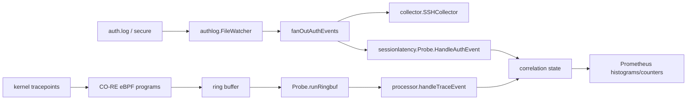
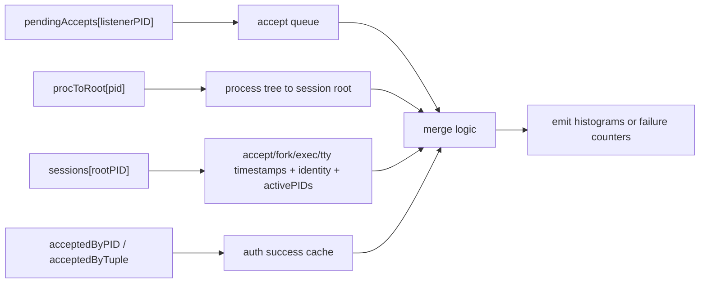
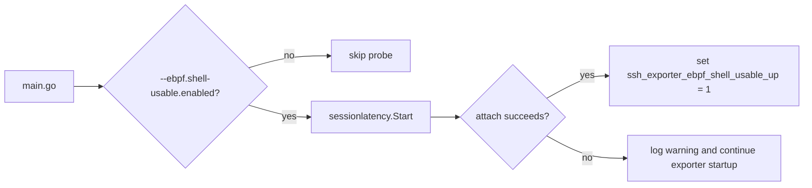

# eBPF Shell Usable Latency Architecture

This document describes the optional eBPF-based architecture behind the interactive SSH shell latency metrics:

- `ssh_accept_to_shell_usable_seconds`
- `ssh_accept_to_child_fork_seconds`
- `ssh_child_fork_to_shell_exec_seconds`
- `ssh_shell_exec_to_first_tty_output_seconds`
- `ssh_shell_usable_failures_total`
- `ssh_exporter_ebpf_shell_usable_up`

The implementation lives in [ebpf/sessionlatency/probe_linux.go](/Users/y-tsubouchi/src/github.com/yuuki/ssh_sesshon_exporter/ebpf/sessionlatency/probe_linux.go), [ebpf/sessionlatency/processor.go](/Users/y-tsubouchi/src/github.com/yuuki/ssh_sesshon_exporter/ebpf/sessionlatency/processor.go), and [ebpf/sessionlatency/bpf/probe.c](/Users/y-tsubouchi/src/github.com/yuuki/ssh_sesshon_exporter/ebpf/sessionlatency/bpf/probe.c).

## Scope

This feature measures only **interactive PTY SSH sessions**.

- Included: normal shell logins that eventually produce PTY output
- Excluded: `scp`, `sftp`, `ssh host cmd`, and other non-interactive sessions
- Proxy for "usable": the first PTY output, not the literal shell prompt render time

## High-Level Flow

The eBPF side observes low-level SSH lifecycle events from the kernel. The Go side converts those events into wall-clock timestamps, correlates them with auth success events from the auth log, and emits Prometheus metrics with `user` and `remote_ip` labels.

## Tracepoints and Event Model

### Tracepoints used

| Tracepoint | Event | Payload |
|------------|-------|---------|
| `syscalls/sys_enter_accept`, `sys_exit_accept` | `EVENT_ACCEPT` | listener sshd PID, remote_ip, timestamp |
| `syscalls/sys_enter_accept4`, `sys_exit_accept4` | `EVENT_ACCEPT` | (same as above) |
| `sched/sched_process_fork` | `EVENT_FORK` | child PID, parent PID, timestamp |
| `sched/sched_process_exec` | `EVENT_EXEC` | PID, exec filename or comm, timestamp |
| `tty/tty_write` | `EVENT_TTY_WRITE` | PID, bytes, timestamp |
| `sched/sched_process_exit` | `EVENT_EXIT` | PID, timestamp |

### Write fallback

Some environments do not expose `tty/tty_write` reliably. In that case the probe falls back to:

- `syscalls/sys_enter_write`
- `syscalls/sys_exit_write`
- `syscalls/sys_enter_writev`
- `syscalls/sys_exit_writev`

The fallback is intentionally narrower than a real PTY event. It exists to keep the metric available on systems such as Rocky Linux where the tty tracepoint path is not stable enough for this use case.

## Userspace Correlation State

The Go processor maintains four main state tables.

### `pendingAccepts`

Maps the listening `sshd` PID to a FIFO of `accept()` events.

- Stores: `remote_ip`, accept timestamp
- Purpose: attach the first matching forked session process to a specific accepted connection
- Expiration: stale entries are dropped as `accept_orphaned`

### `procToRoot`

Maps any observed process PID to a session root PID.

- The root PID is the per-session sshd child or a synthetic root created from auth success fallback
- All later `fork`, `exec`, `tty_write`, and `exit` events are folded into the root session state

### `sessions`

Tracks the lifecycle of one candidate interactive session.

- `acceptTS`
- `forkTS`
- `shellExecTS`
- `firstTTYWriteTS`
- `user`
- `remoteIP`
- `deadline`
- `sawShellExec`
- `sawTTYWrite`
- `activePIDs`

This state is what eventually turns into the four latency histograms.

### `acceptedByPID` and `acceptedByTuple`

Short-lived auth success caches populated from `authlog.AuthEvent`.

- `acceptedByPID`: exact PID match when auth and observed process lineage align
- `acceptedByTuple`: fallback queue keyed by `{user, remote_ip}`

These caches exist because OpenSSH privilege separation often breaks any simple "auth PID equals shell PID" assumption.

## Correlation Logic

### Normal path

1. A listening `sshd` process returns from `accept()`
2. A child process is forked for that connection
3. A shell-like executable is observed at `sched_process_exec`
4. The session produces its first PTY output
5. An auth success event (from auth log) provides `user` and authoritative `remote_ip`
6. The processor emits all four histograms

### Out-of-order tolerance

Real systems do not always deliver events in a neat order. The processor intentionally tolerates several reorderings.

- `tty_write` may arrive before auth success
- `tty_write` may arrive before shell exec is observed
- auth success may arrive after the session's child PIDs have already exited
- fork tracepoint `comm` fields may be empty on Rocky, so parent PID plus accept FIFO is treated as the source of truth

Because of that, the processor buffers partial state and finalizes later instead of failing immediately.

## Histogram Semantics

The processor emits four histograms per completed interactive session. All use the same bucket layout (`0.01, 0.025, 0.05, 0.1, 0.25, 0.5, 1, 2.5, 5, 10, 30`) and carry `user` and `remote_ip` labels.

| Metric | Definition |
|--------|-----------|
| `ssh_accept_to_child_fork_seconds` | `forkTS - acceptTS` |
| `ssh_child_fork_to_shell_exec_seconds` | `shellExecTS - forkTS` |
| `ssh_shell_exec_to_first_tty_output_seconds` | `firstTTYWriteTS - shellExecTS` |
| `ssh_accept_to_shell_usable_seconds` | `firstTTYWriteTS - acceptTS` |

## Failure Paths

`ssh_shell_usable_failures_total` (label: `stage`) makes the correlation quality visible in production.

- `accept_orphaned`: an accepted connection never found a matching session
- `fork_unmatched`: a fork event could not be associated with any pending accept
- `shell_exec_missing`: a candidate session timed out before a shell-like exec was observed
- `tty_write_timeout`: shell exec was seen, but no usable PTY output arrived before the timeout
- `exited_before_usable`: the process tree exited before producing a usable shell
- `identity_unmatched`: tracepoint activity was seen, but no auth success could be attached
- `events_dropped`: the ring buffer or raw event decoding failed

## Startup and Degradation Behavior

The eBPF probe is optional by design.

- If attach succeeds, the probe exports health and latency metrics
- If attach fails, the exporter still serves the auth-log and utmp metrics
- Probe shutdown is tied to the main process context

## Operational Notes

- This feature usually requires root privileges
- The kernel must expose BTF metadata for the bundled CO-RE object
- The histograms include `user` and `remote_ip`, so cardinality can grow quickly on bastion hosts
- `user` and `remote_ip` labels come from `authlog.AuthEvent`, not from kernel-side observation. eBPF-side `remote_ip` is used only as a correlation hint before auth success arrives. This avoids incomplete or misleading identity on Rocky-based systems
- `ssh_exporter_ebpf_shell_usable_up` should be treated as the first health signal
- `ssh_shell_usable_failures_total` is the first place to look when the histograms stop moving
